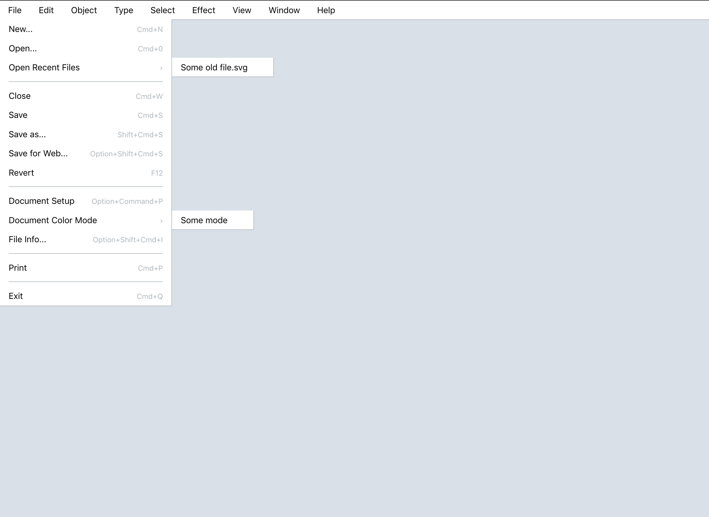

## Setup

```bash
$ docker-compose up
```

Visit `http://localhost:3000`


## What we're building

This thought experiment uses a tree-like data structure to store the data for the menu. It then walks the tree and selects the React component to correctly render the content based on a node's type.



## Most interesting files

* The [menu data](editor/src/components/MainMenu/data.js)
* The [renderMenu](editor/src/components/MainMenu/utilities.js) function
* The components
  * [MainMenu](editor/src/components/MainMenu/index.js)
  * [MainMenuNav](editor/src/components/MainMenu/MainMenuNav.js)
  * [MainMenuNavItem](editor/src/components/MainMenu/MainMenuNavItem.js)
  * [MainMenuSeparator](editor/src/components/MainMenu/MainMenuSeparator.js)

## Other thoughts

By moving the onClick handlers to another file and referencing them only by name (as a string), it would be easier to write tests. Also, that would mean that the entire tree could be serialized as JSON. That could be handy, for example, if there was a toggle to change the keyboard shortcuts to accommodate different OSs, for example.
